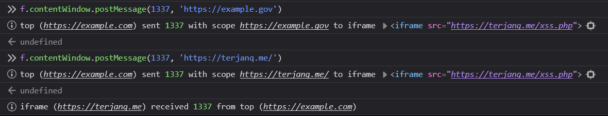
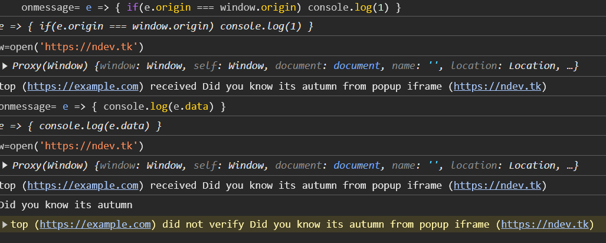

# postLogger

Extension to log postMessage()
- console.info for postMessages from all_frames.
- detects the scope of sent messages.
- origins that are insecure due to being a sandbox domain or a wildcard, will be prefixed with UNSAFE.
- detects if a website does not check MessageEvent.origin
- MessageChannel API

https://chrome.google.com/webstore/detail/aodfhblfhpcdadgcnpkfibjgjdoenoja
https://addons.mozilla.org/en-US/firefox/addon/postlogger/

## Message Classification

This extension now classifies messages logged by the extension based on their content. This helps in identifying potentially malicious or sensitive information being passed via `postMessage`.

The current classification categories are:
- **Potential XSS**: Identifies messages that may contain script tags, indicating a potential Cross-Site Scripting attempt.
- **Potential Sensitive Data**: Flags messages that include keywords like "password", "credit card", or "ssn", suggesting the possible transmission of sensitive information.
- **General Information**: For all other messages that do not fall into the above categories.

*Note: This classification is heuristic-based. Future enhancements could include a more sophisticated AI model for more accurate and nuanced threat detection.*

# Warning
May cause unexpected behavour, if you find a security issue contact me.
